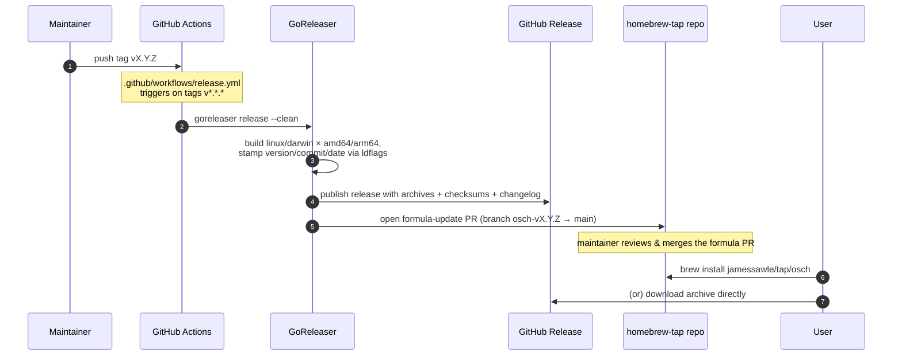

# Release flow

A release is cut by pushing a semver tag. Everything after that is automated by
GitHub Actions and [GoReleaser](https://goreleaser.com). The rationale for this
tooling is in [ADR 0002](../adr/0002-distribution-homebrew-and-releases.md) and
[ADR 0003](../adr/0003-release-tooling-goreleaser.md).

## Sequence

## Steps

1. **Tag.** A push of a tag matching `v*.*.*` triggers
   `.github/workflows/release.yml`. The checkout uses `fetch-depth: 0` so
   GoReleaser can see history for the changelog.
2. **GoReleaser builds.** `CGO_ENABLED=0` static binaries for `linux` and
   `darwin` on `amd64` and `arm64`, with `version`, `commit`, and `date`
   stamped into `main` via `-ldflags`.
3. **GitHub Release.** Archives (`tar.gz`, including `LICENSE` and `README.md`),
   a `checksums.txt`, and a generated changelog are published. Pre-releases are
   detected automatically from the tag.
4. **Homebrew tap.** GoReleaser opens a pull request against
   `jamessawle/homebrew-tap` (on branch `osch-<tag>`, base `main`) updating the
   `Formula/osch` formula. This uses the `HOMEBREW_TAP_TOKEN` secret. Opening a
   PR rather than pushing directly is deliberate — the formula change is
   reviewed before it reaches tap users.
5. **User installs.** Once the formula PR is merged, users install via
   `brew install jamessawle/tap/osch`, or download an archive from the Release
   directly.

## Secrets

- `GITHUB_TOKEN` — provided automatically; used to create the Release.
- `HOMEBREW_TAP_TOKEN` — a token with write access to the tap repo; used to open
  the formula-update PR.
